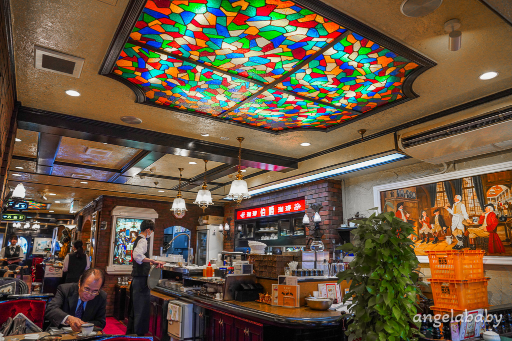

# ☕ 巢鴨 伯爵咖啡館 (伯爵珈啡館)

## 📌 基本資訊
- **地點名稱**：伯爵珈啡館 (伯爵咖啡館)
- **類型**：復古風喫茶店、早餐推薦
- **地址**：東京都豊島區巢鴨 1-12-3
- **Google Maps**：[點此開啟地圖](https://maps.app.goo.gl/R7UUTPGDjixMxJoT9)
- **營業時間**：
  - 週一至週五：07:00 - 17:00 (最後點餐時間：食物 16:00，飲品 16:30)
  - 週六、週日：07:00 - 20:00 (最後點餐時間：食物 19:00，飲品 19:30)
- **建議停留時間**：1 - 2 小時
- **Tabelog**：[3.53 分](https://tabelog.com/tw/tokyo/A1323/A132301/13012419/)

## 🚆 交通指南
- **距離車站**：JR 巢鴨站步行約 2 分鐘。

## 📝 筆記與特色
- **昭和復古氛圍**：懷舊復古卻不失華麗的典型歐式風格，有紅色絨布椅子、彩繪玻璃天花板及紅磚牆，服務生穿著昭和風格西式套裝。
  
  
- **遊戲機餐桌**：部分桌子是結合電動機台的設計，投幣即可邊吃早餐邊打電動（如俄羅斯方塊）。
  
- **禁菸環境**：目前已改為禁菸環境，設有獨立吸菸室，用餐舒適。
- **早餐套餐 (07:00 - 11:00)**：
  - 價格約 750 ~ 850 日圓。
  - **C 套餐**：焗烤厚片吐司（起司牽絲，柔軟鹹香），搭配優格及香蕉。
  - **三明治套餐**：有蛋沙拉和火腿兩種口味，吐司柔軟香甜，附胡麻醬生菜沙拉。
  - 咖啡順口好喝，冰美式會裝在質感的「不銹鋼杯」中。
  
  
- **其他餐點**：若不想吃早餐，也有提供義大利麵、咖哩飯、燉牛肉以及焗飯（如奶油白醬蝦仁口味）等豐盛選擇。

## ✅ 體驗重點 (Checklist)
- [ ] 體驗昭和風的復古喫茶店氛圍並拍照留念。
- [ ] 尋找並嘗試在遊戲機餐桌投幣玩遊戲（如俄羅斯方塊）。
- [ ] 品嚐高 CP 值的早餐套餐（推薦焗烤厚片吐司或三明治）。
