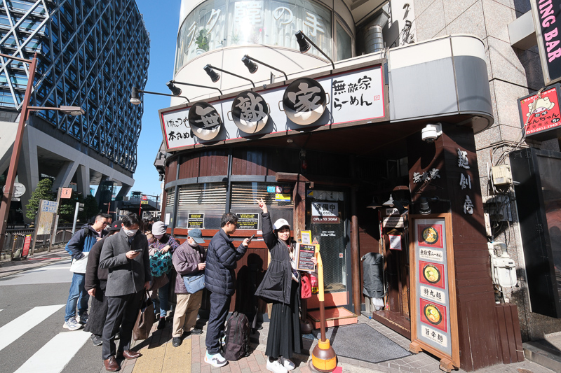
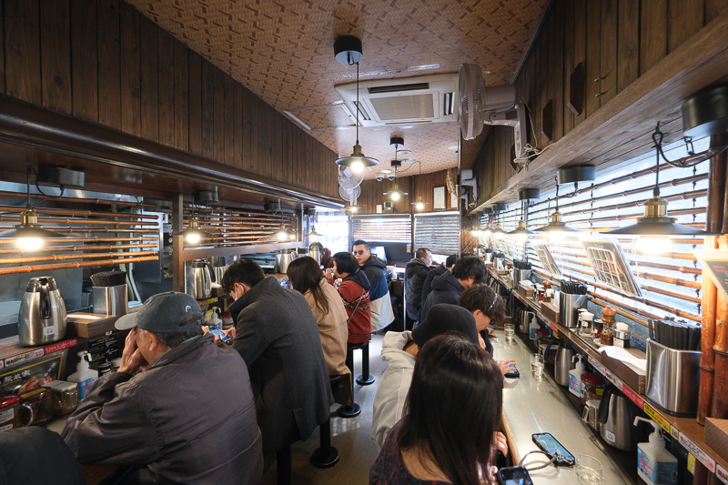
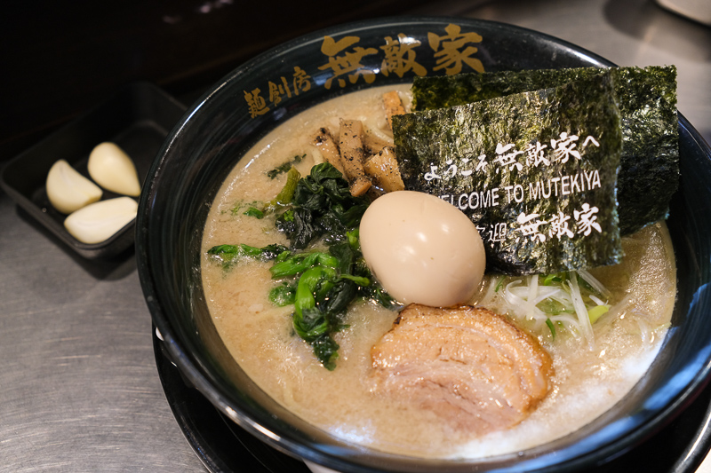

# 🍜 池袋：麵創房 無敵家 (Mutekiya)

> **"抵達東京的第一餐，挑戰池袋最強排隊拉麵！"**

## 📍 店家資訊
- **地址**：東京都豊島区南池袋 1-17-1 (池袋站東口步行約 3 分鐘)
- **營業時間**：10:30 - 隔日 04:00
- **支付方式**：**僅收現金 (Cash Only)** ⚠️

## ⚠️ 排隊禁忌 (必讀)
- **嚴禁解壓縮**：必須「全員到齊」才能進入排隊隊伍。
- **排隊預估**：尖峰時段通常需等待 1-1.5 小時，排隊時店員會先行提供菜單點餐。

## 🥢 推薦菜單
1. **No.1 無敵家拉麵 (無敵家ラーメン)**：
   - 第一次來必點！有三片特厚叉燒（炙燒、原味、柚子胡椒），湯頭濃郁。
2. **特丸麵**：
   - 豬背脂愛好者首選，湯頭最為濃厚重口味。
3. **煎餃 (餃子)**：
   - 外皮酥脆，適合大家分食。

## 💡 用餐小秘訣
- **解膩神水**：桌上有濃縮「無糖茉莉花茶」，加入冰水可以大幅緩解豚骨湯頭的油膩感。
- **免費服務**：可向店員索取「紙圍巾」(以免噴到衣服) 或「髮圈」。
- **菜單差異**：店家有分外國版與日本版菜單，配料與價格略有不同，點餐時可稍作留意。

## 📸 店家與餐點圖片
- 
- 
- 
- 
- 

---
*資訊來源：整理自 Bobby Fun 旅遊部落格*
