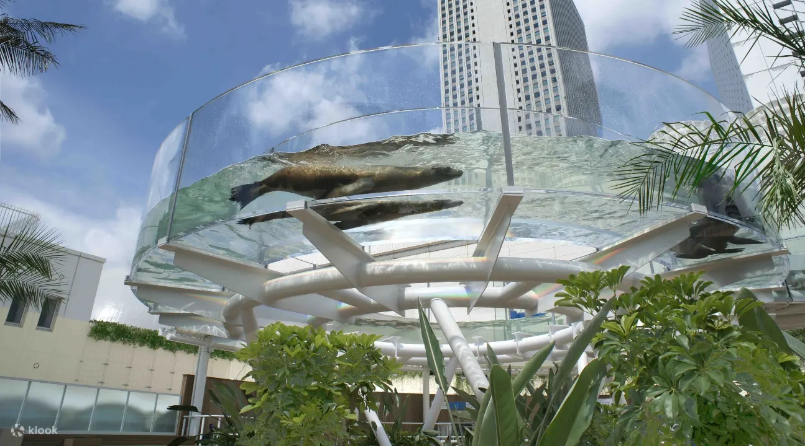

# 🐧 Sunshine Aquarium (陽光水族館)

## 📌 基本資訊
- **官方網站**：[Sunshine Aquarium](https://sunshinecity.jp/zh-tw/aquarium/)
- **地點名稱**：Sunshine Aquarium (陽光水族館)
- **地址**：東京都豐島區東池袋 3-1 (Sunshine City 頂樓 Rooftop)
- **Google Maps**：[陽光水族館 (點擊導航)](https://maps.app.goo.gl/v11Xw4M8Qh6d1Y2P6)
- **營業時間**：10:00 - 18:00 (依季節可能有所變動，建議出發前確認)
- **建議停留時間**：1.5 - 2 小時

## 圖片參考

## 🎟️ 門票資訊
- **KKday 購票連結**：[東京池袋陽光水族館門票](https://www.kkday.com/zh-tw/product/166262-sunshine-aquarium-60-observation-deck-park-ikebukuro-tokyo?cid=5193&ud1=DSA&ud2=product&ud3=sa&ud4=tw&ud5=20793808031&adid=10101010&gad_source=1&gad_campaignid=20793808031&gbraid=0AAAAADZji1DiIOYcyecaZO83pJ8ufDU4o&gclid=CjwKCAiA-__MBhAKEiwASBmsBBpMB-W0vQAN11djqVpXkIWmS6a7kIWNUZWHoz5imQEUu4hAhju-nhoCC3gQAvD_BwE&groupOid=1)
- **票價參考**：平日票價 **521元** (實際價格依匯率與官方公告為準)
- **注意事項**：假日或連假期間人潮眾多，建議事先在網路上預先購票以節省現場排隊時間。

## 🚆 交通指南
- **從池袋站出發**：JR / 地鐵 / 私鐵「池袋站」東口出站後，步行約 8 - 10 分鐘，沿著有蓋陽光 60 街道 (Sunshine 60 Dori) 前進。搭乘電梯直達 Sunshine City 的頂樓。
- **從東池袋站出發**：東京地鐵有樂町線「東池袋站」步行約 3 分鐘 (地下連通道直達)。

## ✅ 必逛重點 (Checklist)
- [ ] **天空的企鵝 (天空のペンギン) / 草原的企鵝**：陽光水族館最具代表性的展區，可以從透明水槽下方仰望企鵝在城市天際線中游泳的模樣，或在草地上觀察牠們。
- [ ] **陽光柔水環 (サンシャインアクアリング)**：海獅在頭頂上的環形水槽中游動。
- [ ] **水母隧道 (海月空感)**：夢幻般的弧形水母展區，超級療癒。
- [ ] 觀賞室內各類海洋生物與定時的餵食秀。

## ⚠️ 展區注意事項
- **戶外展區**：擁有許多戶外展區 (如企鵝、海獅)，請留意天氣狀況。
