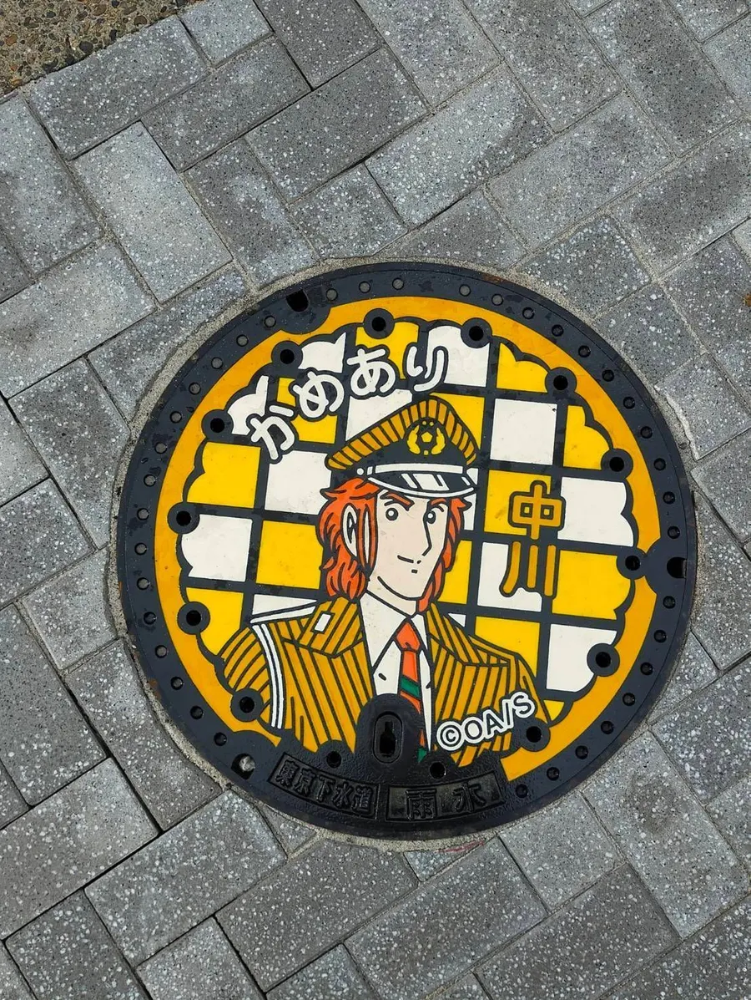
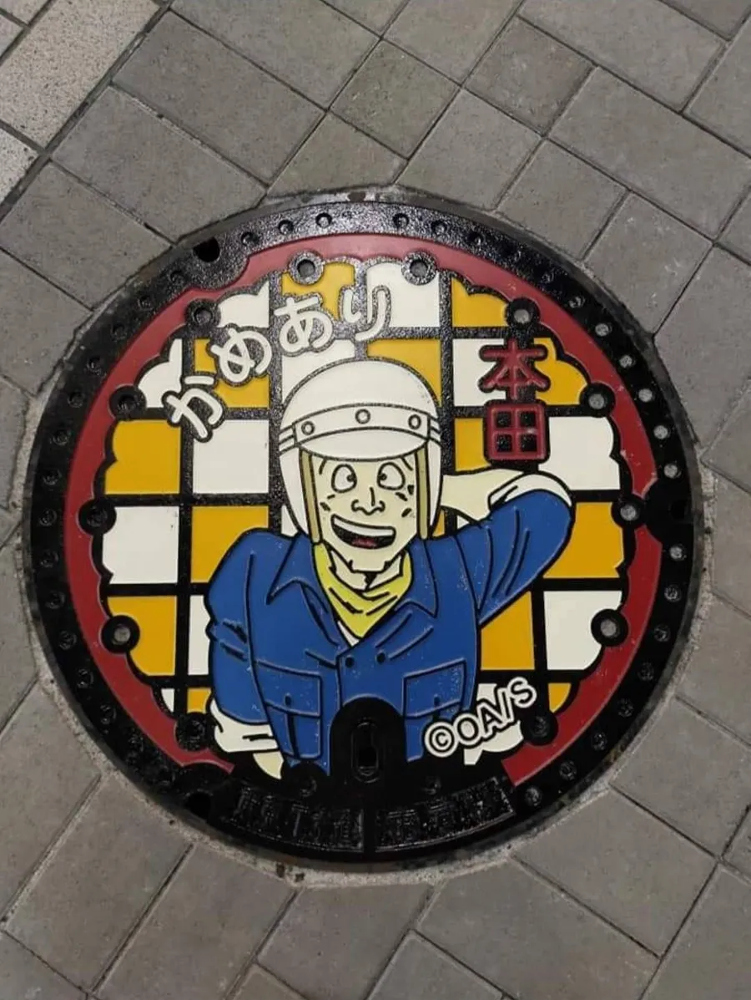
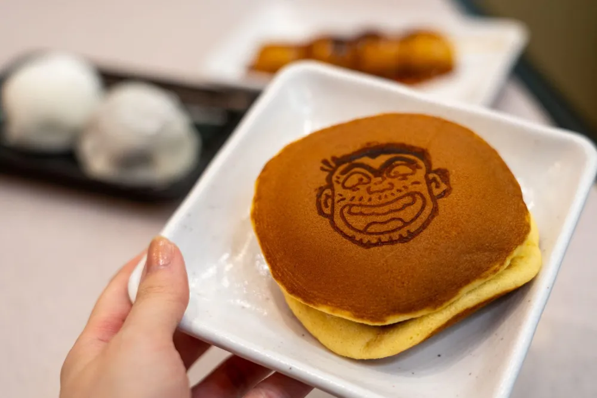
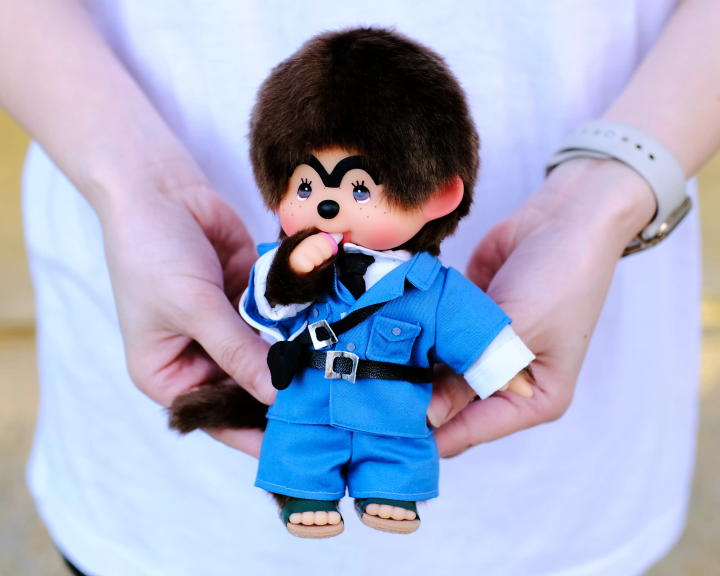

# 📍 龜有：烏龍派出所聖地巡禮

## 📌 基本資訊
- **地點名稱**：龜有車站周邊 & Ario 龜有購物中心 (可作為非必要備案行程)
- **Google Maps**：[龜有車站 (點擊導航)](https://maps.app.goo.gl/vLXYaUqKwuywuYgf6)
- **建議停留時間**：2 - 3 小時
- **參考行程**：[ATT JAPAN 龜有烏龍派出所半日遊](https://att-japan.net/zh_tw/kamearicourse/)

## 🎒 交通與行李攻略
- **從池袋出發**：千代田線直通運轉 (約 40 分鐘)
- **從機場出發**：參見 [[轉乘指南_成田機場往龜有]]
- **行李寄放處**：
  - [ ] 龜有站北口投幣式置物櫃 (數量有限)
  - [ ] Ario 龜有購物中心 1F 置物櫃 (適合大件行李)

## ✅ 必做清單 (Checklist)
- [ ] 拿取官方巡禮地圖並收集兩津勘吉銅像
- [ ] 於「龜有觀光案內所」領取水溝蓋紀念小卡並尋找特色水溝蓋
- [ ] 參觀真實的「龜有公園前派出所」外觀
- [ ] 龜有香取神社參拜，祈求「烏龜御守」
- [ ] 品嚐 Go Go Curry 限定阿兩咖哩與阿兩銅鑼燒
- [ ] (備案) 逛 Ario 龜有購物中心 3F 烏龍派出所遊樂場

## 📸 景點與美食介紹

### 巡禮打卡點
- **收集兩津勘吉銅像**：建議出站先拿官方巡禮地圖。北口有兩津勘吉祭典服姿銅像；南口有兩津勘吉、中川、麗子彩色銅像。
  - 
  - 
- **參觀真實的「龜有公園前派出所」**：位於車站北口正前方，記得只在外面拍照，別打擾真實警察辦公喔！
- **收集特色水溝蓋**：
  - 於「龜有觀光案內所」可以領取水溝蓋紀念小卡。
  - 
  - 
  - 
  - 

### ⛩️ 龜有香取神社
- 推薦祈求特色「烏龜御守」。
  - 

### 🍴 當地小吃與限定美食
- **Go Go Curry Kameari Stadium**：吃限定的阿兩咖哩
  - 
- **阿兩銅鑼燒**：
  - 

### 🎡 Ario 龜有購物中心 (非必要行程)
- **3F「哥吉拉與烏龍派出所遊樂場」**：
  - 尋找實體化重現的派出所佈景。
  - 在遊樂場夾娃娃機小試身手。

## 🏛️ 烏龍派出所紀念館 (需事先預約)
- **門票費用**：每人約 700 日圓
- **相關連結**：
  - [官方網站](https://kochikame-kinenkan-official.jp/?utm_source=goodlucktrip)
  - [線上預約連結](https://www.e-tix.jp/kochikame-kinenkan/)
- **參考圖片**：
  - 
  - 
  - 
  - 

## ⚠️ 注意事項
- 銅像分散在車站南北口，有些在公園內，有些在巷口，建議穿好走的鞋子。
- 真實派出所**不能**進入參觀，拍照請在對街或保持距離。
